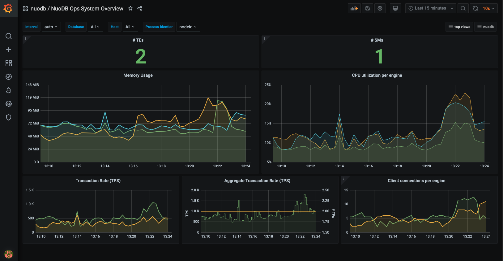

# NuoDB Insights - Visual Monitoring

[](https://travis-ci.com/nuodb/nuodb-insights)

### Repository Structure:

| Directory | Description                                            |
|-----------|--------------------------------------------------------|
| conf      | dashboards and data sources for provisioning in grafana |
| deploy    | YAML configuration files for the monitor stack |
| images    | contains png included in this README |
| stable    | Helm Charts for Kubernetes Environments |

## Sample Dashboard




# NuoDB Insights Page Outline
[Introduction](#Introduction)

[Quick Start in Docker using Docker Compose](#Quickstart-in-docker-using-docker-compose)

[Setup Manually in Docker using Docker Run](#Setup-manually-in-docker-using-docker-run)

[Setup in Kubernetes](#Setup-in-Kubernetes)

[Setup on Bare Metal Linux](#Setup-on-bare-metal-linux)

## Introduction

NuoDB Insights is a visual monitor tool that aids NuoDB practicianers in monitoring NuoDB database health, resoruce consumption, and application workload processed in real-time and historically using an intuitive graphical interface. It can be installed at database startup or after. It also installs locally on the same nodes/hosts your database runs and supports all NuoDB database deployment environments: Kubernetes, Docker, and physical host / Virtual Machine environments. 

## Quickstart in Docker using Docker Compose

For a complete example on how to set up the NuoDB database with NuoDB Insights monitoring, you can use `docker compose`.
This repository contains a Docker Compose file (`deploy/docker-compose.yml`) which will start:

- 1 Admin Processes
- 1 Storage Manager
- 2 Transaction Engines
- 2 NuoDB Collector containers (1 for SM, 1 for TE)
- 1 InfluxDB database
- 1 Grafana and NuoDB Dashboards
- 1 YCSB Demo Workload generator

Clone the NuoDB Insights repository and `cd` into it:

```
git clone https://github.com/nuodb/nuodb-insights.git
cd nuodb-insights
```

Then run `docker-compose up` to start the processes specified in the Docker Compose file:
```
docker-compose -f deploy/docker-compose.yaml up -d
```

Stop processes started with `docker-compose up` by running the following command:

```
docker-compose -f deploy/docker-compose.yaml down
```

If you already have a NuoDB database running, and you only need to start NuoDB insights, run the `deploy/monitor-stack.yaml` file instead.

Once all docker images are running successfully, NuoDB performance can be visualized by navigating to the [NuoDB Insights - NuoDB Ops System Overview](http://localhost:3000/d/000000004/nuodb-ops-system-overview), and start exploring the NuoDB dashboards. The default password in Grafana is `admin:admin`.

## Setup manually in Docker using Docker Run

### Download the Docker Images

```
docker pull nuodb/nuodb-ce:latest
docker pull nuodb/nuodb-collector:latest
docker pull influxdb:latest
docker pull grafana/grafana:latest
```

### Get NuoDB Insights
```
git clone https://github.com/nuodb/nuodb-insights.git
cd nuodb-insights
```

### Starting NuoDB Insights
First, you should create a Docker network.
All NuoDB components should be running on this network.
```
docker network create nuodb-net
```

Second, start an InfluxDB server.
We will use an init script that will generate the required databases.

```
docker run -d --name influxdb \
      --network nuodb-net \
      -p 8086:8086 \
      -p 8082:8082 \
      -v $PWD/deploy/initdb.sh:/docker-entrypoint-initdb.d/initdb.sh \
      influxdb:latest
```

As the final step, start Grafana with the NuoDB dashboards.
```
docker run -d --name grafana \
      --network nuodb-net \
      -p 3000:3000 \
      --env INFLUX_HOST=influxdb \
      -v $PWD/conf/provisioning:/etc/grafana/provisioning \
      grafana/grafana:latest
```

You can now start your NuoDB database with the NuoDB Collector.
For more info on how to start your database, please refer to the [NuoDB Docker Blog Part I](https://nuodb.com/blog/deploy-nuodb-database-docker-containers-part-i) and the readme for [NuoDB Collector](https://github.com/nuodb/nuodb-collector).

You can use the example NuoDB YCSB workload generator to explore the various dashboards.
```
docker run -dit --name ycsb1 \
      --hostname ycsb1 \
      --network nuodb-net \
      --env PEER_ADDRESS=nuoadmin1 \
      --env DB_NAME=test \
      --env DB_USER=dba \
      --env DB_PASSWORD=goalie \
      nuodb/ycsb:latest /driver/startup.sh
```

## Setup in Kubernetes

### Helm Repository Structure

This Github repository contains the NuoDB Insights Helm Chart and all the required components to install and deploy NuoDB Insights.

### Installation

If you are new to Kubernetes and Helm, please read the [high-level description](stable/README.md) in the Stable directory. 

For specific configuration options, see the [Insights Helm Chart Readme](stable/insights/README.md).

## Setup on Bare Metal Linux

The following installation instructions apply to Red Hat and CentOS Linux distributions on bare-metal or VMs. For other platforms, see [InfluxDB](https://docs.influxdata.com/influxdb/latest/introduction/install/) and [Grafana](https://grafana.com/docs/grafana/latest/installation/) installation instructions.

### 1) Download and install InfluxDB

Install `InfluxDB` on the same host machine referred to by `<hostinflux>` in the [NuoDB Collector](https://github.com/nuodb/nuodb-collector#configuration) installation instructions.

```
wget https://dl.influxdata.com/influxdb/releases/influxdb-1.8.3.x86_64.rpm
sudo yum localinstall -y influxdb-1.8.3.x86_64.rpm
sudo systemctl start influxdb
```

If not using `systemd`, `InfluxDB` can be started directly as follows:

```
env $(cat /etc/default/influxdb | xargs) influxd -config /etc/influxdb/influxdb.conf
```

### 2) Download and install Grafana with NuoDB-Insights dashboards

On a host in your NuoDB domain, install Grafana and configure it to use the NuoDB-Insights dashboards.

```
wget https://dl.grafana.com/oss/release/grafana-7.3.1-1.x86_64.rpm
sudo yum localinstall -y grafana-7.3.1-1.x86_64.rpm

git clone https://github.com/nuodb/nuodb-insights.git
sudo rm -rf /etc/grafana/provisioning
sudo cp -r nuodb-insights/conf/provisioning /etc/grafana
sudo mkdir -p /etc/grafana/provisioning/notifiers /etc/grafana/provisioning/plugins
sudo chown -R root:grafana /etc/grafana/provisioning
sudo chmod 755 $(find /etc/grafana/provisioning -type d)
sudo chmod 640 $(find /etc/grafana/provisioning -type f)
```

Once installed, Grafana can be started with InfluxDB as a datasource by using the `INFLUX_HOST` environment variable. In the below `echo` command, peplace `<hostinflux>` with the machine host name that is running your InfluxDB instance, and run, 

```
echo "INFLUX_HOST=<hostinflux>" >> /etc/sysconfig/grafana-server
sudo systemctl enable grafana-server
sudo systemctl start grafana-server
```

If not using `systemd`, Grafana can be started as follows:

```
sudo /etc/rc.d/init.d/grafana-server start
```

### 3) Install NuoDB Collector on all hosts with database processes

Follow the instructions for installing the [NuoDB Collector on bare-metal](https://github.com/nuodb/nuodb-collector#setup-on-bare-metal). The NuoDB Collector must be set up on all hosts that will run NuoDB database processes.

Once all components have been set up, NuoDB performance can be visualized by navigating to the NuoDB Insights - NuoDB Ops System Overview dashboard at `http://<hostgrafana>:3000/d/000000004/nuodb-ops-system-overview`, where `<hostgrafana>` is the host that the Grafana server was started on. The default password in Grafana is `admin:admin`.

## Status of the Project

This project is still under active development, so you might run into [issues](https://github.com/nuodb/nuodb-insights/issues). If you do, please don't be shy about letting us know, or better yet, contribute a fix or feature.
